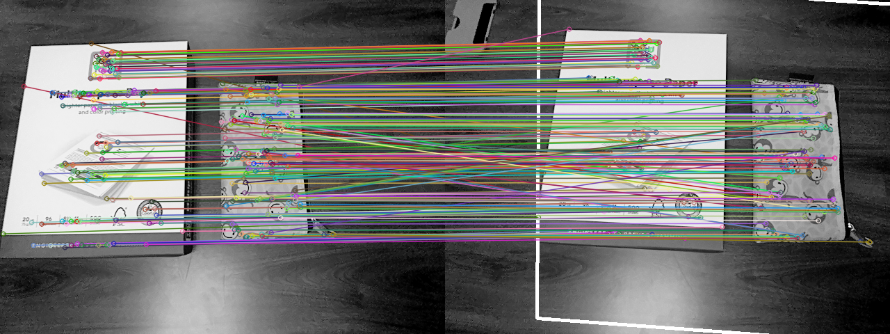

# Assignment 2

Video link: [here](https://drive.google.com/file/d/1SbCCBMoqGMIA3kLQBEoVlgsGFgHmxVi1/view?usp=share_link)

## Question 1 

The algorithm can be found in the the file 'q1.ipynb' 

The code prompts the user to take a 10 seconds video. The video frames are stored in the folder "video_frames". 

These frames are used for this and the subsequent questions.

### a.

I randomly chose an image from the image frames and performed Harris corner detection and canny edge detection on the image. The images with the corners and edges have been stored in the folder.

  
   

### b.

I randomly chose another image from the video frames. I then found the homography matrix between the 2 images and plotted a line mapping to map similar points between the two images. The homography matrix can be found in the jupyter notebook.

  

## Question 2, 4 & 5

Image stitching is being implemented in questions 2, 4 and 5, with little changes. Hence, I made a modular code that can be used with all the use cases.

The function allows you to use either SIFT or ORB features based on parameters. The function takes 2 images as input and returns the stiched image.

### 2.

>> NOTE: I have used SIFT features to stitch the images as the question doesnt mention which feature to use. 

I took 5 sets of 3 images and stiched them together. The images and the stiched output can be found in the folder "image_stitching"

 

### 4.

I chose a pair of images randomly from the video image frames and applied the above funtion on the same. For this question, I made use of SIFT features.

 

### 5.

I chose a pair of images randomly from the video image frames and applied the above funtion on the same. For this question, I made use of ORB features.

 

## Question 3

Find the code for this question in q3.ipynb. The function converts the image into integral image. The output matrix can be seen in the jupyter notebook. The matrix has also been stored in 'integral_img.txt' for better understanding.
