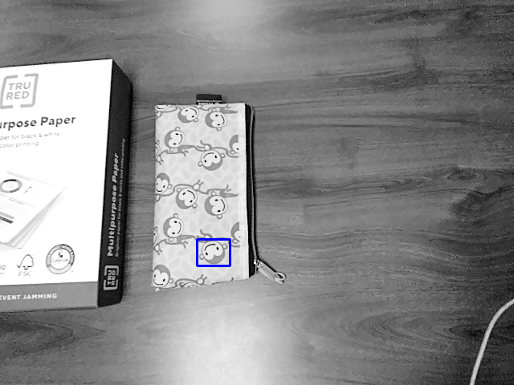
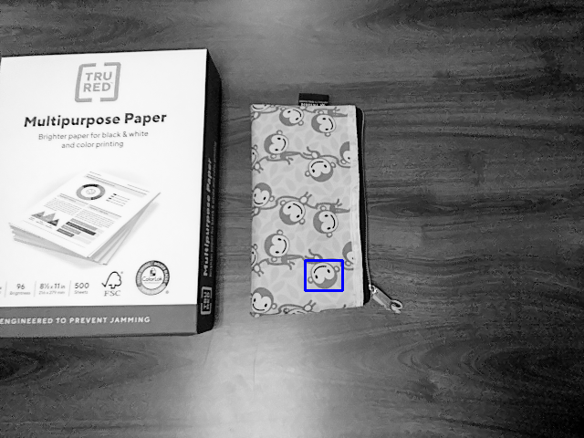
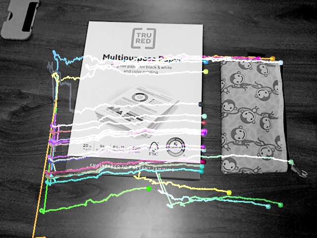
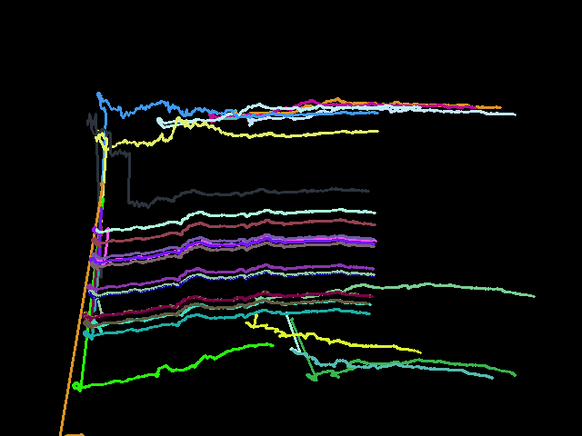
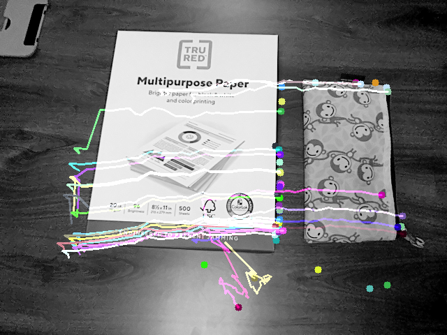
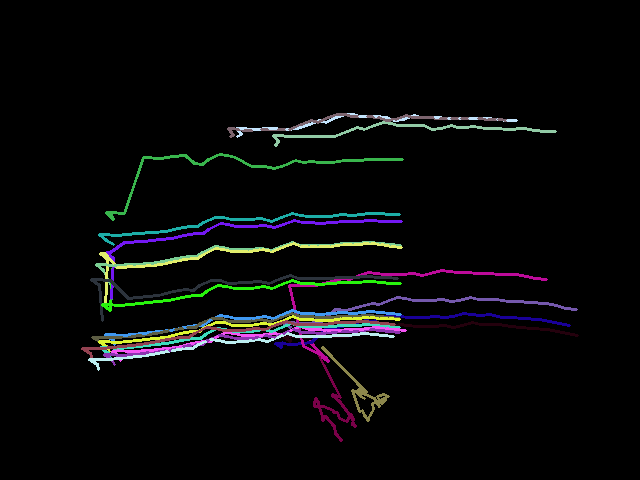
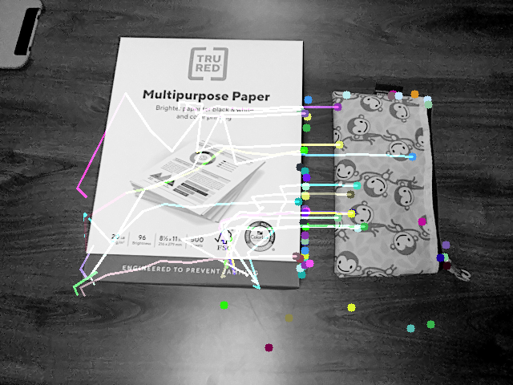
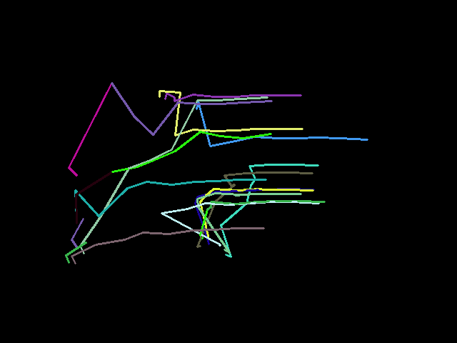
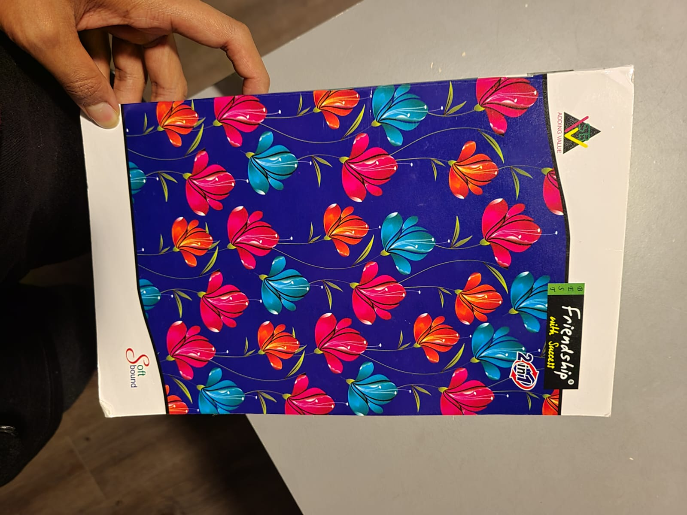
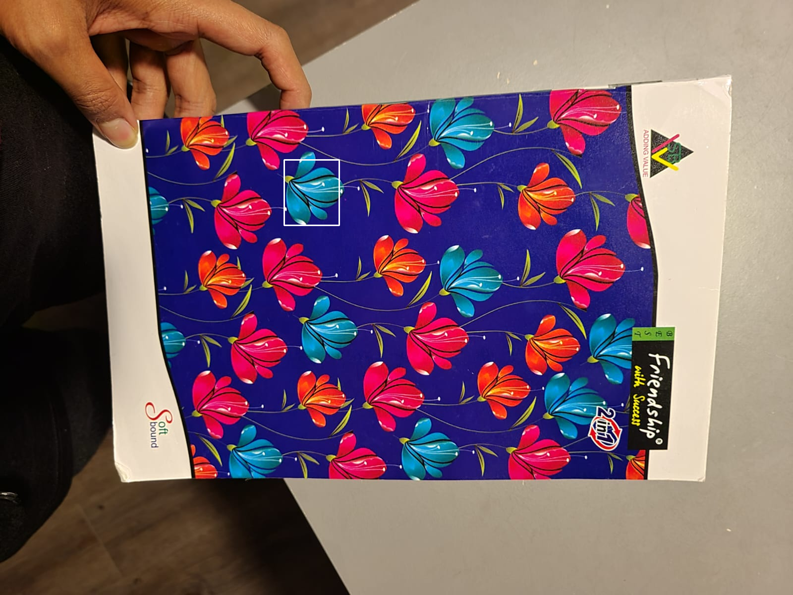

# Assignment 3 

## Question 1 

The algorithm can be found in the the file 'q1/q1.ipynb' 

The code prompts the user to take a 10 seconds video. The video frames are stored in the folder "video_frames". 

These frames are used for this and the subsequent questions.

I manually selected a good frame from the frame list and cropped out a region of interest (roi.png)

The pattern (roi) is then used to search in 10 randomly selected images from the video frames. 

The images in which pattern is found using "Sum of squared differences" is stored in the folder "q1/pattern_match_ssd" 

The images in which pattern is found using "Normalized correlation" is stored in the folder "q1/pattern_match_ncor" 

  
   

## Question 2

## Question 3

The algorithm can be found in q3/q3.ipynb

I first took the frames from 'video_frames' directory and appended them into a list (frame_array) in alpha-numeric order. Then

The first frame is used to find good corners. The subsequent frames use these good corners as reference points.

I created a function that plots the optical flow vectors on each frame treating every nth frame as a reference frame. By default, n is set as 1 (i.e. every previous frame).

The outputs obtained are stored in directory 'optical_flow'

> every previous frame as a reference frame

  
  

> every 11th frame as a reference frame

  
  

> every 31st frame as a reference frame

  
  

## Question 4

The algorithm can be found in q4/q4.ipynb

I first took a few images i captured using my oak d lite camera. I cropped out the image to get the objects into frame

  

I then took 2 objects i was interested in.

  
  

I created a function that detects the objects in the image.
The outputs obtained are stored in directory 'object_detected'

  
  

